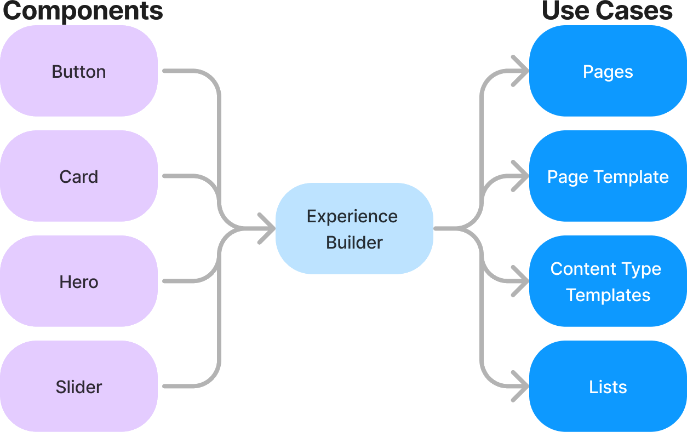
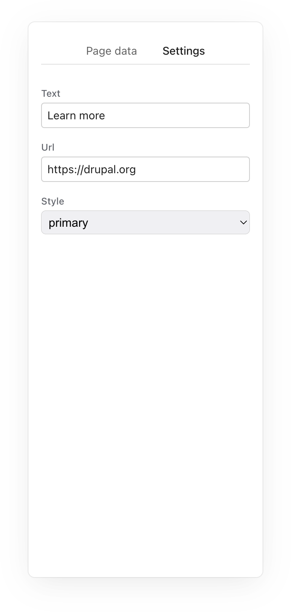
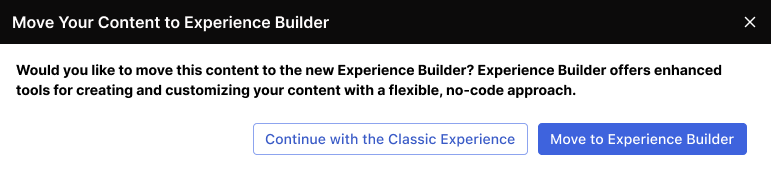

---

## Alternate titles

<del>My experience building the Experience Builder experience</del>

<del>Are you experienced?</del>

<del>Do you want to build an experience?</del>

Note:
- Taking the joke too far
- Of course a Hendrix reference
- I'm told this is a frozen reference

---

### About me

@larowlan

Note:

- Drupal development for 16+ years
- PHP Development for 25 😮
- Core committer, Security team, you're probably using one of my modules
- You may not know but FE dev is what I'm excited about - although my last few DS sessions have been FE

---

## Session summary

- Goals of Experience Builder (XB)
- Demo of current state
- A dive into the internals

Note:
- So if that's not what you were expecting, it's fine if you want to leave

---

## Goals preface

- https://youtu.be/5ViCxc8ksb4

Note:

- I'm not going to go into too much detail here. This is a technical session
- I strongly recommend you watch Lauri's excellent session from DrupalCon Singapore
- It goes into much more detail
- This is mandatory watching if you expect you will be using Drupal in 12 months time from now
- Some of the images I'm using here were taken from Lauri's session - he kindly shared it with me

---

## Goals

Drupal CMS epic #2

<blockquote>Make building easier by guiding site builders to success with common best practices and state-of-art innovations</blockquote>

---

### Goals

XB should be a low-code editor for:
<ul>
<li class="fragment" data-fragment-index="1">Creating content and pages</li>
<li class="fragment" data-fragment-index="1">Building components👈️</li>
<li class="fragment" data-fragment-index="1">Managing site design👈️</li>
</ul>

Note:

- So if you're used to something like Paragraphs or Layout Builder you might notice item 2 and 3 on that list are not in that realm
- These are things we would normally require code for
- If you've been doing Drupal long enough you might remember a module called Sweaver

---

### Foundation built on Components

Note:

- So before we saw 'Common best practices' in the Epic
- I'm sure many of you are building your site with a Component driven approach
- This might be formally with something like SDC or Pinto
- You might also be making use of Storybook - something I spoke about at last year's DrupalSouth
- Nothing is changing on this front. If you're already doing this

---

### State-of-the-art innovations

🤔 What does that mean exactly?

Note:

- Not just talking about taking Drupal to a whole new level and piping composer into varnish with real world issue queues
- We're being very ambitious here
- We're targeting a UX similar to Figma or Builder.io
- Drag and drop, WYSIWYG, real-time updates
- Leaning on modern JavaScript
- Roadmap includes multi-user

---

## Demo time

---

## What's under the hood?

<ul>
<li class="react">React</li>
<li class="redux">Redux Toolkit</li>
<li class="redux">RTK Query</li>
<li class="ts">Typescript</li>
<li class="vite">Vite</li>
<li class="swc">SWC (wasm)</li>
<li class="radix">Radix UI</li>
<li class="astro">Astro</li>
<li>...</li>
</ul>

---

## So do I need to learn all of these 😱?

---

## No 😌

---

## Building with XB

Note:

- So if you're using SDC, you've got nothing to do
- If you're not, you likely need a component source plugin (more on this later)

---

## Prop shape matching

<pre>
  <code class="language-yaml">name: Heading
status: stable
group: Atom/Text
description: A heading element
props:
  type: object
  required:
    - text
    - element
  properties:
    text:
      type: string
      title: Text
      description: The heading text.
      examples: ['A heading element']
    style:
      type: string
      title: Style
      description: The heading style to use.
      enum:
        - primary
        - secondary
      examples: [primary, secondary]
    element:
      $ref: json-schema-definitions://experience_builder.module/heading-element
      type: string
      title: Element
      description: The HTML element to use.
      examples: [h1, h2, h3, h4, h5, h6, div]
  </code>
</pre>

---

## Yields you

---

## How does this work?

<pre class="fragment"><code class="language-yaml">uuid: b333695b-d2ac-4484-8e2a-cf7940edad19
langcode: en
status: true
dependencies:
  module:
    - options
label: Heading
id: sdc.experience_builder.heading
source: sdc
category: Atom/Text
settings:
  plugin_id: 'experience_builder:heading'
  prop_field_definitions:
    element:
      field_type: list_string
      field_storage_settings:
        allowed_values:
          -
            value: div
            label: div
          -
            value: h1
            label: h1
          -
            value: h2
            label: h2
          -
            value: h3
            label: h3
          -
            value: h4
            label: h4
          -
            value: h5
            label: h5
          -
            value: h6
            label: h6
      field_instance_settings: {  }
      field_widget: options_select
      default_value:
        value: h1
      expression: ℹ︎list_string␟value
    style:
      field_type: list_string
      field_storage_settings:
        allowed_values:
          -
            value: primary
            label: primary
          -
            value: secondary
            label: secondary
      field_instance_settings: {  }
      field_widget: options_select
      default_value:
        value: primary
      expression: ℹ︎list_string␟value
    text:
      field_type: string
      field_storage_settings: {  }
      field_instance_settings: {  }
      field_widget: string_textfield
      default_value:
        value: 'A heading element'
      expression: ℹ︎string␟value
</code></pre>

Note:
- Components are stored as config entities
- Each component references a source plugin
- There's SDC, Code components and Block ATM
- Future work will add layout (slots/props) and paragraphs (props, maybe slots)
- Shape matching inspects the props
- If we can represent the SDC with existing data-types and widgets in core, a component is auto created
- If not, there's a report telling you why your SDC component isn't compatible
- The component looks like this

---

## Wait so it's Form/Field API? 😕

---

## Yes ... but

---

## Hyperscriptfy™️

Note:

- This started life as the JSX theme engine on Drupal.org
- Ended up in XB as 'semicoupled theme'
- It is the magic sauce

---

## How it works

- Separate theme (xb_stark)
- Semicoupled theme engine

Note:

- This is an implementation detail and is subject to change
- It's not an API but it is useful info

---

## Semicoupled theme

File: radios.html.twig
<pre>
<code class="language-json">
{
  "props": {
    "renderChildren": "JSX.Element",
    "children": "JSX.Element",
    "attributes":  "object"
  }
}
</code>
</pre>

Note:

- This is a theme template. Its JSON in TWIG
- It tells the theme engine how the render array variables map to concepts in React

---

## Hyperscriptify™️

<pre>
<code class="language-html" data-line-numbers="1,11|2-3,9-10|4-8|2"><template data-hyperscriptify>
  <drupal-form attributes="{&quot;class&quot;:[&quot;component-inputs-form&quot;],&quot;data-form-id&quot;:&quot;component_inputs_form&quot;,&quot;data-drupal-selector&quot;:&quot;component-inputs-form&quot;,&quot;action&quot;:&quot;/xb-field-form/node/1?tree=%7B%22nodeType%22%3A%22component%22%2C%22uuid%22%3A%22dynamic-image-udf7d%22%2C%22type%22%3A%22sdc.experience_builder.image%22%2C%22slots%22%3A%5B%5D%7D&amp;props=%7B%22dynamic-image-udf7d%22%3A%7B%22resolved%22%3A%7B%22image%22%3A%7B%22src%22%3A%22/sites/default/files/2024-12/generateImage_aNOaam.jpeg%22%2C%22alt%22%3A%22At%20decet%20nobis%20nulla%20probo%20singularis%20validus%20vindico.%22%2C%22width%22%3A207%2C%22height%22%3A475%7D%7D%2C%22source%22%3A%7B%22image%22%3A%7B%22sourceType%22%3A%22dynamic%22%2C%22expression%22%3A%22%E2%84%B9%EF%B8%8E%E2%90%9Centity%3Anode%3Aarticle%E2%90%9Dfield_hero%E2%90%9E%E2%90%9F%7Bsrc%E2%86%9Dentity%E2%90%9C%E2%90%9Centity%3Afile%E2%90%9Duri%E2%90%9E%E2%90%9Furl%2Calt%E2%86%A0alt%2Cwidth%E2%86%A0width%2Cheight%E2%86%A0height%7D%22%7D%7D%7D%7D&amp;selected=dynamic-image-udf7d&amp;latestUndoRedoActionId=&amp;ajaxPageState=%7B%22libraries%22%3A%22ckeditor5/internal.drupal.ckeditor5%2Cckeditor5/internal.drupal.ckeditor5.codeBlock%2Cckeditor5/internal.drupal.ckeditor5.emphasis%2Cckeditor5/internal.drupal.ckeditor5.htmlEngine%2Cckeditor5/internal.drupal.ckeditor5.image%2Cckeditor5/internal.drupal.ckeditor5.table%2Ccomment/drupal.comment%2Ccore/ckeditor5.autoformat%2Ccore/ckeditor5.blockquote%2Ccore/ckeditor5.horizontalLine%2Ccore/ckeditor5.link%2Ccore/ckeditor5.list%2Ccore/ckeditor5.pasteFromOffice%2Ccore/ckeditor5.removeFormat%2Ccore/ckeditor5.sourceEditing%2Ccore/drupal.autocomplete%2Ccore/drupal.collapse%2Ccore/drupal.vertical-tabs%2Cexperience_builder/xb-ui%2Cfile/drupal.file%2Cfilter/drupal.filter%2Cmenu_ui/drupal.menu_ui%2Cnode/drupal.node%2Cnode/form%2Cpath/drupal.path%2Ctext/drupal.text%22%2C%22theme%22%3A%22xb_stark%22%2C%22theme_token%22%3A%22XsulWe41qhjCwf0CyulJBlNu832XpRTn77W3m_obYIo%22%7D&quot;,&quot;method&quot;:&quot;dialog&quot;,&quot;id&quot;:&quot;component-inputs-form&quot;,&quot;accept-charset&quot;:&quot;UTF-8&quot;}">
    <drupal-html-fragment slot="children">
      

        <fieldset id="some-fieldset">
        <!-- ... -->
        </fieldset>
      

    </drupal-html-fragment>
  </drupal-form>
</template>
</code>
</pre>

Note:

- So we end up with a 'template' tag which the browser doesn't parse
- Hyperscriptify will turn this into a DOM tree
- It then walks the tree and finds any custom elements we have matching React components for
- In this example, `<drupal-html-fragment>` `<drupal-form>` are examples
- But div and fieldset are not
- For anything we match, create react elements and JSON.parse the `attributes` attribute as props
- Regular children (standard HTML) are in the HTML fragment

---

## Is this madness?

[Jurassic park Jeff Goldblum meme]

Note:

- It is working well
- It even supports AJAX
- We even have it integrating with Redux
- The alternative is what Decoupled LB did - which required all widgets and formatters to be rewritten in React
- Lauri made 'should work with existing widgets' a requirement

---

## But I use {paragraphs|layout builder}

What happens to legacy sites?

Note:

- LB is a subset of the model
- So is paragraphs
- We have plans for an upgrade in place approach - chat to me after the session

---

## But I use [my custom thing]

Write a Component Source Plugin

<code>GeneratedFieldExplicitInputUxComponentSourceBase</code>

Note:

- auto create these config entities if you can (There is no UI to do it, user requirement)
- if you write a source plugin you should too
- e.g. see the example for Code/SDC components
- If you don't have an existing field UI paradigm (e.g. Paragraphs has manage form/display) you can extend GeneratedFieldExplicitInputUxComponentSourceBase
- this gives you prop sources, shape matching, widget reuse, transforms

---

## Component source plugin

<pre><code class="language-php">
interface ComponentSourceInterface {
  public function getReferencedPluginClass(): ?string;
  public function getComponentDescription(): TranslatableMarkup;
  public function renderComponent(array $inputs, string $componentUuid): array;
  public function requiresExplicitInput(): bool;
  public function getExplicitInput(string $uuid, ComponentTreeItem $item): array;
  public function hydrateComponent(array $explicit_input): array;
  public function inputToClientModel(array $explicit_input): array;
  public function getPluginDefinition(): array;
  public function getClientSideInfo(Component $component): array;
  public function buildConfigurationForm(/*...*/): array;
  public function clientModelToInput(/*...*/): array;
  public function validateComponentInput(/*...*/): ConstraintViolationListInterface;
  public function checkRequirements(): void;
}
</code></pre>

---

### Join us?

- 🗨️ Join #experience-builder on drupal.slack.org

Note:
- As you've seen, there is a real mix of tech here
- There's lots of opportunities to get involved

---

### Questions❓

- 🗨️ larowlan #australia-nz / drupal.slack.org
- Get a time machine and attend yesterday's contribution day
- Chat with me in the hall
